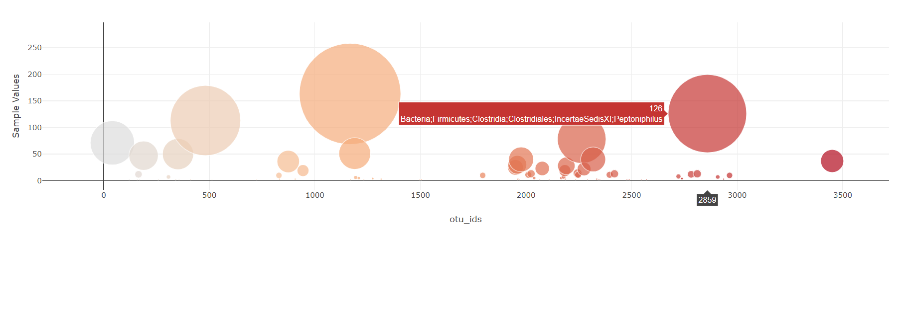

# Belly Button Biodiversity Web Dashboard
https://ksid-bellybutton-analysis.herokuapp.com/

Dataset Source: (http://robdunnlab.com/projects/belly-button-biodiversity/)

excerpt from robdunnlab-
"The belly button is one of the habitats closest to us, and yet it remains relatively unexplored. In January 2011, we launched Belly Button Biodiversity to investigate the microbes inhabiting our navels and the factors that might influence the microscopic life calling this protected, moist patch of skin home. In addition to inspiring scientific curiosity, Belly Button Biodiversity inspired conversations about the beneficial roles microbes play in our daily lives."

#### Step 1: Dashboard building
* Used Plotly.js to build interactive charts.
* Created pie chart to display the bacteria percentage in the sample selected in dropdown menu.
  * Hovertext in pie chart lists details of each species found.

  

* Create a Bubble Chart that uses data of the selected sample in dropdown menu.

  * Used `otu_ids` for the x values

  * Used `sample_values` for the y values

  * Used `sample_values` for the circle size

  * Used `otu_ids` for the marker colors

  * Used `otu_labels` for the text values

  

#### Step 2: Heroku Deployment
(https://ksid-bellybutton-analysis.herokuapp.com/)

* Deployment of Flask app to Heroku.

* Sqlite file was used for database.

